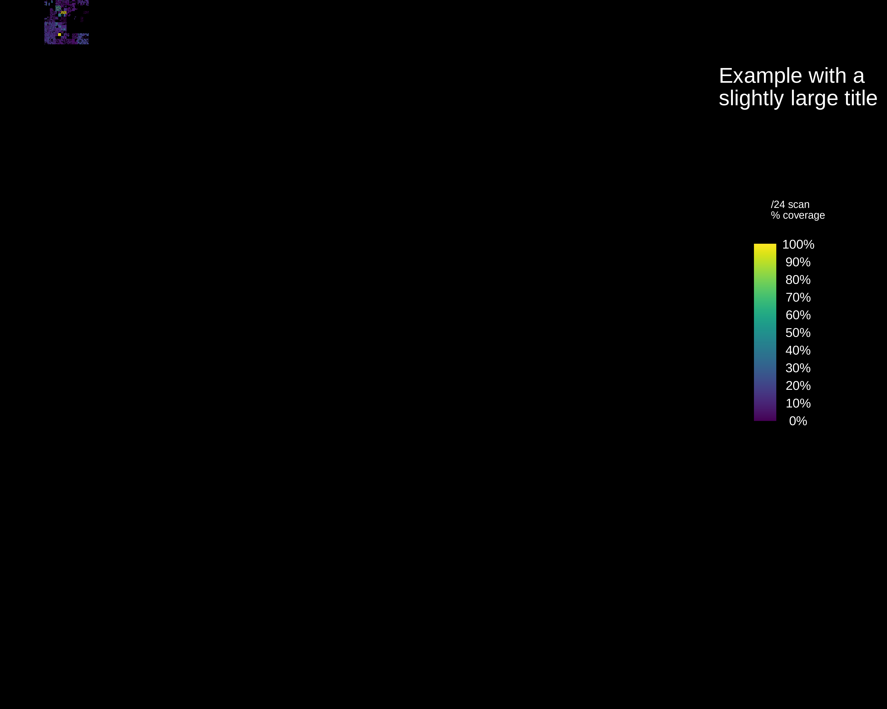

# ipv4-heatmap

Update to The Measurement Factory ipv4-heatmap codebase (i.e. the seminal code to generate Hilbert curve IPv4 heatmaps)

This new one uses the [viridis](https://cran.r-project.org/web/packages/viridis/vignettes/intro-to-viridis.html) color palette which is much easier on the eyes. You can also use a few colorbrewer palettes: `brbg`, `puor`, `rdbu`, `rdgy`, `rdylbu`, `spectral`, `bupu`, `reds`, `ylgnbu`, `ylorbr`, `ylorrd` via the `-P palette` directive and invert the sequence with the `-i` option.

If you really need your "blue->red" back, use `-i -P rdbu`

I would have included more example images but they are YUGE, so you can find them [here](https://www.dropbox.com/sh/wqyly8ewxeko5jn/AAC5bHIpQTuxWGBPYzMqceLQa?dl=0).

Liberation Sans has been included to provide an alternative to the X11 font the original program seems desperate to use. This is an example for how to use TTF fonts (not all TTF fonts seem to work):

    ipv4-heatmap -u "/24 scan\n% coverage" \
                 -f extra/LiberationSans-Regular.ttf \
                 -t "Example with a\nslightly large title" < extra/ip1m

